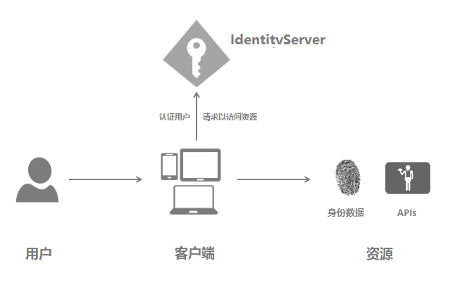

# OAuth2.0
OAuth 是一种授权机制。资源的所有者授权第三方从资源托管者手中取得资源。  
实现方式：资源的所有者从授权中心（资源托管者信任）获取一个令牌（token），第三方通过这个令牌从资源托管者手中取得资源。


## OAuth2.0引入了两个措施
1. Oauth2.0 要求，refresh token 一定是保存在客户端的服务器上的，而绝不能存放在狭义的客户端（例如移动 app、PC端软件） 上。调用 refresh 接口的时候，一定是从服务器到服务器的访问；

2. Oauth2.0 引入了 client_secret 机制。即每一个 client_id 都对应一个 client_secret。这个 client_secret 会在客户端申请 client_id 时，随 client_id 一起分配给客户端。客户端必须把 client_secret 妥善保管在服务器上，决不能泄露。刷新 access token 时，需要验证这个 client_secret。

## 角色
- Resource Owner：资源拥有者
- Resource Server：资源服务器
- Client：第三方应用客户端
- Authorization Server：授权服务器，管理Resource Owner、Client和Resource Server的三角关系的中间层。



## 授权流程
```
+--------+                               +---------------+
|        |--(A)- Authorization Request ->|   Resource    |
|        |                               |     Owner     |
|        |<-(B)-- Authorization Grant ---|               |
|        |                               +---------------+
|        |
|        |                               +---------------+
|        |--(C)-- Authorization Grant -->| Authorization |
| Client |                               |     Server    |
|        |<-(D)----- Access Token -------|               |
|        |                               +---------------+
|        |
|        |                               +---------------+
|        |--(E)----- Access Token ------>|    Resource   |
|        |                               |     Server    |
|        |<-(F)--- Protected Resource ---|               |
+--------+                               +---------------+
```

## 令牌与密码差异
- 令牌有时效性
- 令牌可以作废
- 令牌有权限范围（scope）

## 授权类型(Authorization Grant)
### 授权码(authorization code)
适用于浏览器和后端同时参与的应用。安全性更好
```
+----------+
| Resource |
|   Owner  |
|          |
+----------+
     ^
     |
    (B)
+----|-----+          Client Identifier      +---------------+
|         -+----(A)-- & Redirection URI ---->|               |
|  User-   |                                 | Authorization |
|  Agent  -+----(B)-- User authenticates --->|     Server    |
|          |                                 |               |
|         -+----(C)-- Authorization Code ---<|               |
+-|----|---+                                 +---------------+
  |    |                                         ^      v
 (A)  (C)                                        |      |
  |    |                                         |      |
  ^    v                                         |      |
+---------+                                      |      |
|         |>---(D)-- Authorization Code ---------'      |
|  Client |          & Redirection URI                  |
|         |                                             |
|         |<---(E)----- Access Token -------------------'
+---------+       (w/ Optional Refresh Token)
```
- （A）Client使用浏览器（用户代理）访问Authorization server。也就是用浏览器访问一个URL，这个URL是Authorization server提供的，访问的收Client需要提供（客户端标识，请求范围，本地状态和重定向URL）这些参数。
- （B）Authorization server验证Client在（A）中传递的参数信息，如果无误则提供一个页面供Resource owner登陆，登陆成功后选择Client可以访问Resource server的哪些资源以及读写权限。
- （C）在（B）无误后返回一个授权码（Authorization Code）给Client。
- （D）Client拿着（C）中获得的授权码（Authorization Code）和（客户端标识、重定向URL等信息）作为参数，请求Authorization server提供的获取访问令牌的URL。
- （E）Authorization server返回访问令牌和可选的刷新令牌以及令牌有效时间等信息给Client。

#### Authorization Request
- 参数
  + response_type：必选。值固定为“code”。
  + client_id：必选。第三方应用的标识ID。
  + state：推荐。Client提供的一个字符串，服务器会原样返回给Client。
  + redirect_uri：必选。授权成功后的重定向地址。
  + scope：可选。表示授权范围。
> GET /authorize?response_type=code&client_id=1&state=xyz&redirect_uri=https%3A%2F%2Fclient%2Eexample%2Ecom%2Foauth2&scope=user,photo HTTP/1.1  
> Host: server.example.com

#### Authorization Response
- 参数
  + code：授权码。
  + state：步骤（A）中客户端提供的state参数原样返回。
> HTTP/1.1 302 Found  
> Location: https://client.example.com/oauth2?code=SplxlOBeZQQYbYS6WxSbIA&state=xyz

#### Access Token Request
- 参数
  + grant_type：必选。固定值“authorization_code”。
  + code : 必选。Authorization Response 中响应的code。
  + redirect_uri：必选。必须和Authorization Request中提供的redirect_uri相同。
  + client_id：必选。必须和Authorization Request中提供的client_id相同。
> POST /token HTTP/1.1  
> Host: server.example.com  
> Content-Type: application/x-www-form-urlencoded  
> 
> grant_type=authorization_code&code=123&client_id=1&redirect_uri=https%3A%2F%2Fclient%2Eexample%2Ecom%2Foauth2

#### Access Token Response
- 参数
  + access_token：访问令牌。
  + refresh_token：刷新令牌。
  + expires_in：过期时间。

> HTTP/1.1 200 OK  
> Content-Type: application/json;charset=UTF-8  
>   
> {  
>    "access_token":"2YotnFZFEjr1zCsicMWpAA",  
>    "token_type":"example",  
>    "expires_in":3600,   
>    "refresh_token":"tGzv3JOkF0XG5Qx2TlKWIA",   
>    "example_parameter":"example_value"  
> }

### 隐藏式(Implicit)  
适用于SPA应用，无后端参与直接获取Token。 和授权码的区别是不返回授权码，而是直接返回Token
```
+----------+
| Resource |
|  Owner   |
|          |
+----------+
     ^
     |
    (B)
+----|-----+          Client Identifier     +---------------+
|         -+----(A)-- & Redirection URI --->|               |
|  User-   |                                | Authorization |
|  Agent  -|----(B)-- User authenticates -->|     Server    |
|          |                                |               |
|          |<---(C)--- Redirection URI ----<|               |
|          |          with Access Token     +---------------+
|          |            in Fragment
|          |                                +---------------+
|          |----(D)--- Redirection URI ---->|   Web-Hosted  |
|          |          without Fragment      |     Client    |
|          |                                |    Resource   |
|     (F)  |<---(E)------- Script ---------<|               |
|          |                                +---------------+
+-|--------+
  |    |
 (A)  (G) Access Token
  |    |
  ^    v
+---------+
|         |
|  Client |
|         |
+---------+
```
#### Authorization Request
- 参数
  + response_type：必选。值固定为“token”。
  + client_id：必选。第三方应用的标识ID。
  + state：推荐。Client提供的一个字符串，服务器会原样返回给Client。
  + redirect_uri：可选。授权成功后的重定向地址。
  + scope：可选。表示授权范围。
> GET /authorize?response_type=token&client_id=1&state=xyz&redirect_uri=https%3A%2F%2Fclient%2Eexample%2Ecom%2Foauth2&scope=user,photo HTTP/1.1  
> Host: server.example.com

#### Access Token Response
- 参数
  + access_token：访问令牌。
  + refresh_token：刷新令牌。
  + expires_in：过期时间。
> HTTP/1.1 302 Found
> Location: http://client.example.com/oauth2#access_token=2YotnFZFEjr1zCsicMWpAA&state=xyz&expires_in=3600

注意其和Authorization Code的最大区别在于它是把token信息放在了url的hash部分（#后面），而不是作为参数(?后面)。这样浏览器在访问重定向的Location指定的url时，就不会把这些数据发送到服务器。而Client可以通过读取Location头信息中获取到access_token信息。

### 密码式(password)  
一般用于客户端程序，比如QQ
```
+----------+
| Resource |
|  Owner   |
|          |
+----------+
    v
    |    Resource Owner
   (A) Password Credentials
    |
    v
+---------+                                  +---------------+
|         |>--(B)---- Resource Owner ------->|               |
|         |         Password Credentials     | Authorization |
| Client  |                                  |     Server    |
|         |<--(C)---- Access Token ---------<|               |
|         |    (w/ Optional Refresh Token)   |               |
+---------+                                  +---------------+
```
#### Authorization Request
- 参数
  + grant_type：必选。值固定为“password”。
  + username：必选。用户登陆名。
  + passward：必选。用户登陆密码。
  + scope：可选。表示授权范围。

> POST /token HTTP/1.1  
> Host: server.example.com  
> Content-Type: application/x-www-form-urlencoded  
> 
> grant_type=password&username=blackheart&password=1234  

#### Access Token Response
- 参数
  + access_token：访问令牌。
  + refresh_token：刷新令牌。
  + expires_in：过期时间。

### 客户端凭证(client credentials)  
无用户参与场景，例如：系统间数据对接
```
+---------+                                  +---------------+
|         |                                  |               |
|         |>--(A)- Client Authentication --->| Authorization |
| Client  |                                  |     Server    |
|         |<--(B)---- Access Token ---------<|               |
|         |                                  |               |
+---------+                                  +---------------+
```
#### Authorization Request
- 参数
  + grant_type：必选。值固定为“client_credentials”。
  + scope：可选。表示授权范围。

> POST /token HTTP/1.1  
> Host: server.example.com  
> Content-Type: application/x-www-form-urlencoded  
> 
> grant_type=client_credentials  


## 参考
- https://oauth.net/2/
- https://tools.ietf.org/html/rfc6749
- http://www.ruanyifeng.com/blog/2019/04/oauth_design.html
- https://www.cnblogs.com/linianhui/p/oauth2-authorization.html
- https://www.cnblogs.com/sheng-jie/p/6564520.html